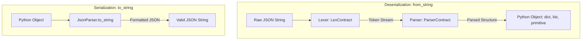
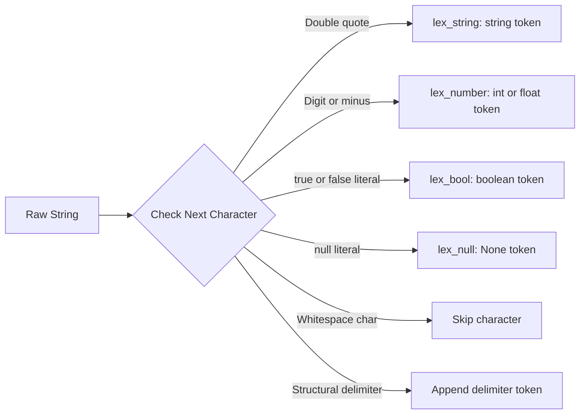

# Architecture & Design

`pyjsonparser` is designed with a classical compiler front-end architecture, separating lexical analysis (tokenizing raw input strings into tokens) from syntactic analysis (building structured Python objects from tokens).

---

## High-Level Pipeline

The following diagram illustrates how raw JSON text is transformed into Python objects and back:



---

## Architectural Principles

### 1. Separation of Concerns & Contracts

Every core component implements an abstract base contract defined in `pyjson.abstract` and `pyjson.core`:

- **`JsonParserContract`**: Defines the public surface (`from_string` and `to_string`).
- **`LexContract`**: Defines token extraction mechanics (`get_tokens`, `lex_string`, `lex_number`, `lex_bool`, `lex_null`).
- **`ParserContract`**: Defines token stream parsing into AST/objects (`parse`, `parse_array`, `parse_object`).

This modular design makes it easy to subclass or mock individual stages for unit testing or custom dialect parsers.

### 2. Module Hierarchy

```
pyjson/
├── __init__.py                  # Exposes JsonParser
├── abstract/
│   ├── __init__.py
│   └── json_parser_contract.py  # JsonParserContract ABC
├── core/
│   ├── __init__.py              # Exposes Lexer, Parser
│   ├── lexer/
│   │   ├── abstract/
│   │   │   └── lex_contract.py  # LexContract ABC
│   │   └── impl/
│   │       └── lex.py           # Lexer implementation
│   ├── parser/
│   │   ├── abstract/
│   │   │   └── parser_contract.py # ParserContract ABC
│   │   └── impl/
│   │       └── parser.py        # Parser implementation
│   └── shared/
│       └── constants.py         # JSON syntax constants
└── impl/
    └── json_parser.py           # JsonParser implementation
```

---

## 1. The Lexer (`pyjson.core.lexer`)

The `Lexer` scans through the character stream from left to right, matching tokens using greedy character consumption:



### Lexer Rules

- **Strings**: Reads characters until an unescaped closing `"` is encountered.
- **Numbers**: Collects digits `0-9`, optional decimal point `.`, exponent `e`, and negative sign `-`. If a decimal point is present, the token is cast to Python `float`; otherwise to `int`.
- **Booleans**: Matches literal `"true"` and `"false"`.
- **Null**: Matches literal `"null"` and emits Python `None`.
- **Syntax Tokens**: Emits single-character delimiters: `{`, `}`, `[`, `]`, `:`, `,`.
- **Whitespace**: Ignored (` `, `\t`, `\b`, `\n`, `\r`).

---

## 2. The Parser (`pyjson.core.parser`)

The `Parser` implements recursive descent parsing over the list of tokens produced by the `Lexer`.

### Grammar & Execution Flow

1. **Root Object Enforcement**: When `is_root=True`, the first token must be `{` (JSON root object requirement).
2. **Object Parsing (`parse_object`)**:
   - Expects alternating `string_key`, followed by `:`, followed by a recursively parsed `value`.
   - Keys must be strings.
   - Key-value pairs are separated by `,` until the closing `}` is encountered.
3. **Array Parsing (`parse_array`)**:
   - Parses successive values separated by `,` until `]` is encountered.
4. **Primitive Values**:
   - Sub-tokens (strings, numbers, booleans, `None`) are returned directly.

---

## 3. The Serializer (`to_string`)

The serialization logic in `JsonParser.to_string()` recursively inspects Python types:

- **`dict`**: Serializes key-value pairs enclosed in `{}` separated by commas.
- **`list`**: Serializes items enclosed in `[]` separated by commas.
- **`str`**: Encloses text in double quotes `"{value}"`.
- **`bool`**: Emits lowercase `"true"` or `"false"`.
- **`None`**: Emits `"null"`.
- **Other types (e.g. `int`, `float`)**: Emits string representation `str(value)`.
